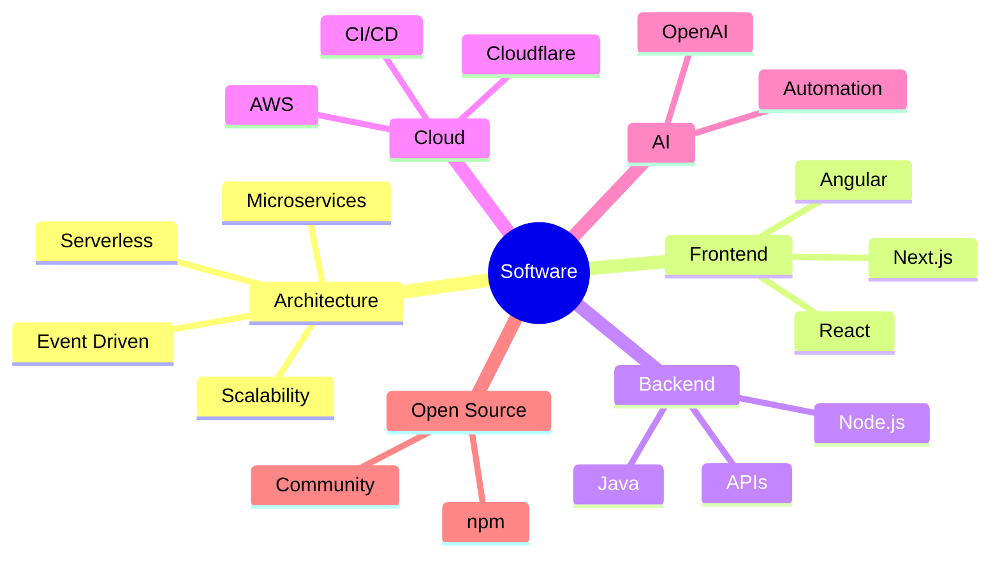

<div align="center">

# 👋 Hey, I'm Sehban Alam

### Software Engineer • Full Stack Developer • Cloud Architect • Open Source Contributor

<p>
Building scalable software, cloud-native systems and developer experiences that people love to use.
</p>

<p>

<a href="https://github.com/sehbanalam">

</a>


</p>


</div>

---

# 👨🏻‍💻 About Me

```typescript
const sehban = {

    role: "Software Engineer",

    location: "New Delhi, India 🇮🇳",

    experience: "10+ Years",

    currentFocus: [
        "Microservices",
        "Cloud Native Applications",
        "AI Integrations",
        "High Performance Frontends"
    ],

    architecture: [
        "Serverless",
        "Event Driven",
        "Distributed Systems",
        "Multi Tenant SaaS"
    ],

    philosophy: [
        "Clean Code",
        "SOLID",
        "DX Matters",
        "Performance First"
    ],

    funFact:
        "I enjoy turning complex business problems into elegant software."
}
```

---

# ⚡ Tech Stack

<div align="center">

### Frontend


### Backend


### Cloud


### Database


### DevOps & Tools


</div>

---

# 🚀 What I Enjoy Building

<table>

<tr>

<td width="50%">

### ☁️ Cloud Applications

- AWS Lambda
- API Gateway
- CloudFormation
- Serverless APIs
- Event Driven Systems

</td>

<td width="50%">

### ⚙️ Backend Systems

- Node.js
- Express
- Authentication
- REST APIs
- Microservices

</td>

</tr>

<tr>

<td>

### 💻 Frontend

- Angular
- Next.js
- React
- Performance Optimization
- SEO

</td>

<td>

### 🧠 Engineering

- System Design
- Architecture
- Code Reviews
- CI/CD
- Technical Mentoring

</td>

</tr>

</table>

---

# 🏆 Highlights

- 🚀 10+ years building production software
- ☁️ AWS Cloud & Serverless Architecture
- 📈 Improved PostgreSQL performance by **60%**
- 👥 Built software used by **100K+ users**
- ⚡ Reduced deployments from weekly to daily using GitHub Actions
- 🧪 Strong believer in Unit Testing & E2E Testing
- 📦 Published Open Source npm packages
- 🤖 Built AI-powered translation pipelines using OpenAI APIs
- ✍️ Technical writer who enjoys sharing knowledge

---

# 📦 Open Source

## 🔹 ngx-seo-helper

Angular SEO toolkit supporting:

- Meta Tags
- Open Graph
- Twitter Cards
- Structured Data
- Canonical URLs

---

## 🔹 ngx-countdown-clock

Angular countdown component featuring:

- Progress Indicators
- Callback Events
- Custom Templates
- Smooth Animations

---

# 🌱 Currently Exploring

```text
✓ AI Engineering
✓ Agentic Workflows
✓ LLM Applications
✓ Software Architecture
✓ Distributed Systems
✓ High Performance Web Applications
✓ Developer Experience
```

---

# 📊 GitHub Analytics

<div align="center">


<br><br>


<br><br>


</div>

---

# 📈 Engineering Mindset



---

# 💬 Favorite Quote

> *"Any fool can write code that a computer can understand. Good engineers write code that humans can understand."*

---

<div align="center">

## 🤝 Let's Connect

<a href="">

</a>

<a href="">

</a>

<a href="">

</a>

<a href="">

</a>

---

### ⭐ Thanks for visiting my profile!

*"Building software that is scalable, maintainable, and enjoyable to work on."*


</div>
